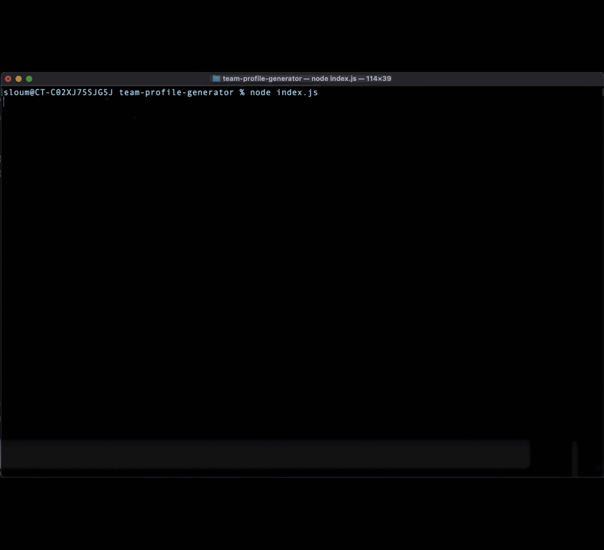
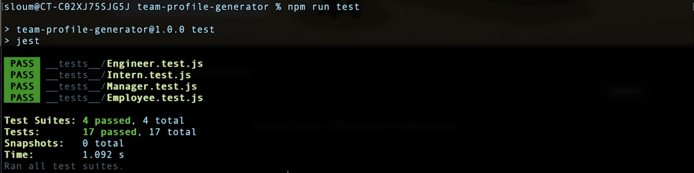

# Team Profile Generator

## Badge

## Description

This Node.js command-line application takes in users' inputs about employees, and generates an HTML webpage that displays these inputs.

## Table of Contents

- [Installation](#installation)
- [Usage](#usage)
- [Instructions](#instructions)
- [Credits](#credits)
- [Tests](#tsests)
- [License](#license)

## Installation

Clone this repo from Github, and download [Node](https://nodejs.org/en/).
Start by typing this command in your project folder: `npm i inquirer` to install the Inquirer package for this application.
For testing download [Jest](https://jestjs.io/docs/getting-started).

## Usage

AS A manager

- I WANT to generate a webpage that displays my team's basic info
- SO THAT I have quick access to their emails and GitHub profiles

## Instructions

Follow the steps in this video to start the application

[Video walk through link](https://drive.google.com/open?id=1ZWPFeOXThS4fRTbNBTT3kN5gIabYNtLF&authuser=0&usp=drive_link)

## Tests

Run `npm test` to run Jest for tests.

## Credits

- [Salma Loum](https://github.com/SalmaLoum)
- [UCLA Extension Bootcamp](https://www.uclaextension.edu/?gclid=Cj0KCQiAgribBhDkARIsAASA5btdbwAz8x25r3b1deoRNIGxfkPFL11rAQMuCgQ7HYiqBH8CLr9CgLoaAktlEALw_wcB&gclsrc=aw.ds)

## License

Please refer to the LICENSE in the repo.

---
